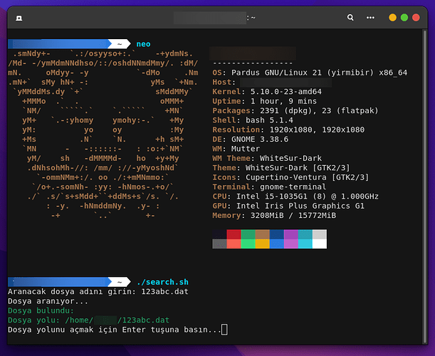

<a href="#">
    
</a>

# searcher CLI
Features Fast and Practical File Search Tool on Servers and Non-Desktop Systems

Install Git Clone 

Github Package Must Be Installed On Your Device.
```bash
sudo apt install git  -y
```

----------------------------------

# Installation
```bash
sudo git clone https://github.com/cektor/searcher-CLI.git
```
```bash
cd searcher-CLI/
```
```bash
sudo chmod +x searcher.sh
```
```bash
./searcher.sh
```
# Screenshot


